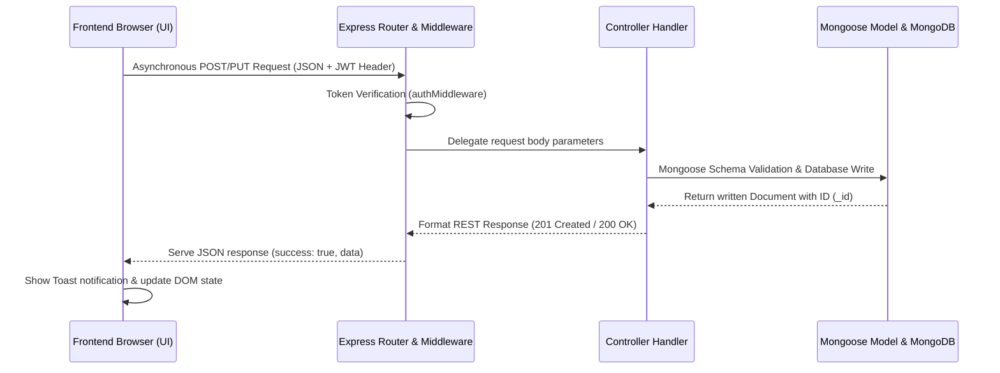
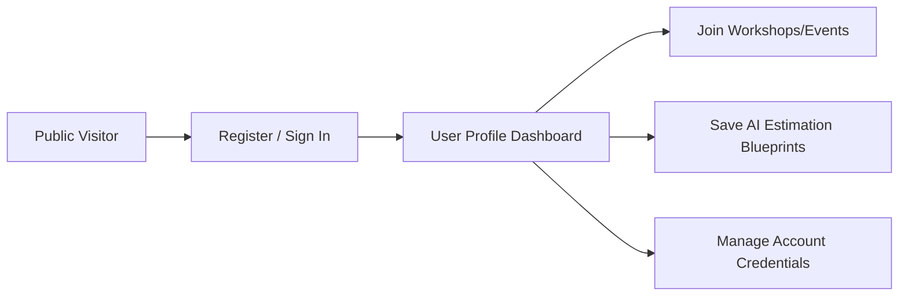
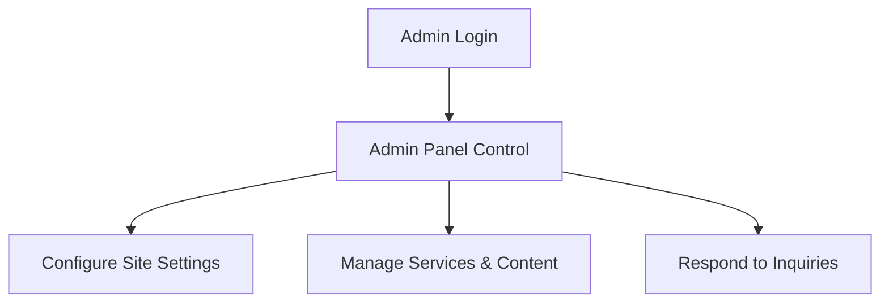
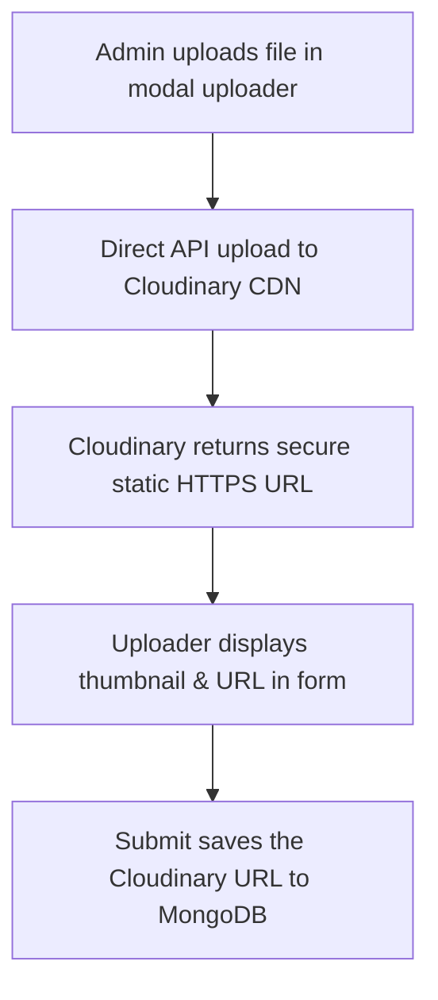

# AI-Solutions Web Portal — Dynamic Enterprise Guide

Welcome to the official developer and user documentation for the **AI-Solutions Web Portal**. This codebase represents a state-of-the-art, responsive, single-page application (SPA) designed to empower businesses with artificial intelligence integrations, automated employee workflows, and real-time custom product estimation.

---

## 📖 Web Portal Introduction

**AI-Solutions** is a modern B2B portal serving as a virtual storefront and operational hub for enterprise AI consultancy, custom software development, and rapid prototyping. 

### Core Tech Stack
* **Frontend**: Vanilla HTML5, CSS3 (with custom utility tokens), TailwindCSS, and asynchronous ES6 Javascript. Icons are powered dynamically by the Lucide framework.
* **Backend**: Node.js runtime environment utilizing Express for RESTful API routing, endpoint controllers, and static server delivery.
* **Database**: MongoDB database engine queried through the Mongoose Object Data Modeling (ODM) library.

### Key System Capabilities
1. **Dynamic Content Engine**: All public website data (hero sections, services list, blog insights, team rosters, regional partners, and client testimonials) are served dynamically from the database.
2. **SaaS-Style Administrative Panel**: Secure portal for system administrators to perform full CRUD operations on all website sections, update site configurations, and directly respond to inquiries.
3. **Customer Hub**: Secure profile center where logged-in clients can track their inquiries, review AI estimation blueprints, change credentials, and sign up for local events.
4. **Conversational AI Prototyping Bot (Aida)**: An interactive assistant that translates conversational prompt requirements into structured pricing and delivery blueprints.

---

## 🔄 Architectural Workflow

The web portal relies on a CD/CI-ready, model-view-controller (MVC) architecture. When user input or state updates occur in the browser, the data moves through the following pipeline:



### Data Pipeline Details
1. **Frontend Action**: A user completes a form (e.g. sending a message or registering for a seminar). Event listeners capture the inputs and construct a JSON payload.
2. **Fetch Request Dispatch**: An asynchronous `fetch()` call is dispatched to the corresponding API endpoint. If the user is authenticated, the secure JSON Web Token (JWT) is appended to the request header as a Bearer token.
3. **Route Parsing & Authentication**: Express matches the path (e.g., `/api/inquiries`) and routes it through authorization middleware to decode user metadata.
4. **Controller Logic**: The controller validates inputs, queries models, and interacts with MongoDB via Mongoose schemas.
5. **Database Transaction**: MongoDB saves the document, generates a unique ObjectId, and returns it.
6. **Dynamic UI Update**: The frontend receives the response, triggers a toast notification, updates lists in the UI, and clears input states without a page reload.

---

## 👤 User Workflow



### 1. Registration & Authentication
* **Standard Register**: Users enter their name, email, and password. Frontend rules check email syntax and password length before creating a password hash on the backend.
* **Google Sign-In**: Users click the Google OAuth button, authenticate in a pop-up window, and receive a secure OAuth token. The backend automatically registers them on their first sign-in.

### 2. Client Profile Center
Once signed in, the header button changes from *Sign In* to *Dashboard*. Clicking it takes the client to their personal workspace:
* **Account Info & Inbox**: Review profile details and read official messages/notifications sent by the admin team.
* **My Inquiries**: View active and historical project estimation plans, contact requests, and chatbot prototype blueprints.
* **Registered Events**: Track seats reserved for Sunderland tech workshops and events.

### 3. Project Estimation & Interactive Chat
* Clients interact with **Aida**, the AI assistant widget.
* When requesting an app estimate, Aida replies in conversational language and attaches a clear project card detailing estimated costs, delivery times, and tech recommendations.
* The user clicks **Save this Plan to Inquiries** to save this project sheet to their dashboard.

---

## 🔑 Administrator Workflow



### 1. Access & Control
* Administrators log in using authorized administrator credentials.
* Upon login, the header button becomes **Admin Panel**. Clicking it reveals a dashboard tailored to site operations.

### 2. Content & Site Settings Management
Administrators can update the website content in real time:
* **Branding & Layout Settings**: Edit company titles, hero copy, office addresses, phone numbers, email support channels, and homepage header images.
* **Services**: Add or modify service listings, turnaround times, prices, and description features.
* **Blogs & Publications**: Publish tech insights and developer guides, select categories, and manage thumbnail images.
* **Events & Seminars**: Post new tech workshops, choose locations, dates, and times, and monitor user attendance.
* **Client Testimonials**: Draft client quotes and add author avatars to populate the homepage feedback carousel.
* **Partners**: Update corporate logos and marquee links for key partners.

### 3. Inquiry Response Pipeline
* Administrators can view incoming user questions, contact messages, and chatbot estimation requests in the **Manage Inquiries** tab.
* Clicking **Reply** opens a panel to write a customized proposal or response.
* Saving the response writes the message to the database, logs a notification in the client's dashboard, and automatically triggers an email dispatch.

---

## 🔒 Security & Authentication Architecture

Security is central to the portal’s backend and database pipelines:

### 1. Password Protection (Hashing)
The database never stores raw passwords. When a registration occurs:
* Mongoose intercepts the document creation in a pre-save hook.
* A cryptographically secure salt is generated using `bcrypt.js`.
* The plain-text password is encrypted into a secure hash before being written to the database.

### 2. Stateless Session Tokens (JWT)
* Upon successful authentication, the backend generates a signed JSON Web Token containing the user's ID, role, and username.
* This token is sent back to the client, stored in `localStorage`, and used to authorize subsequent requests.
* Token validation is managed via authorization middleware:
  ```javascript
  // backend/src/middleware/authMiddleware.js
  const protect = async (req, res, next) => {
    let token = req.headers.authorization?.split(' ')[1];
    if (!token) return res.status(401).json({ success: false, message: 'Not authorized' });
    try {
      const decoded = jwt.verify(token, process.env.JWT_SECRET);
      req.user = await User.findById(decoded.id).select('-password');
      next();
    } catch (e) {
      res.status(401).json({ success: false, message: 'Session invalid' });
    }
  };
  ```

### 3. Role-Based Access Control (RBAC)
* Route endpoints are secured based on user privileges.
* Critical routes (such as updating configurations or deleting content) are protected by administrative check middleware:
  ```javascript
  const adminOnly = (req, res, next) => {
    if (req.user && req.user.role === 'admin') {
      next();
    } else {
      res.status(403).json({ success: false, message: 'Forbidden. Admin privileges required.' });
    }
  };
  ```

---

## ☁️ Cloudinary Media Pipeline

The web portal integrates **Cloudinary** for image uploads in CRUD forms:



### Guide to Uploading Images
1. Log in to the portal as an administrator and click **Admin Panel**.
2. Select a content manager tab (e.g. Services, Blogs, or Team) and click **Add** or **Edit**.
3. Locate the media uploader field inside the modal form:
   * Select the **Upload File** tab.
   * Drag and drop an image from your computer into the upload dropzone.
4. The widget uploads the file directly to Cloudinary's secure media servers.
5. Once completed, a thumbnail preview appears along with a green checkmark.
6. Click **Save** to write the secure Cloudinary URL string (e.g. `https://res.cloudinary.com/...`) to the database document schema.

---

## 📱 Responsive Layout System

The interface is built to adapt dynamically to smartphones, tablets, laptops, and ultra-wide screens.

### Grids & Column Adaptation
* Public content sections (Services, Insights, and Gallery) use fluid grids:
  ```html
  <div class="grid grid-cols-1 md:grid-cols-2 lg:grid-cols-3 gap-8">
  ```
  This ensures layouts adapt smoothly across tablet viewports (like iPad Mini) instead of squishing cards or columns.

### Dashboard Aside Menu
* On desktop viewports, dashboard tabs display as a classic vertical sidebar next to the content area.
* On tablet and mobile viewports, media queries restructure the container:
  - The vertical menu collapses into a horizontal navigation bar.
  - The navigation items scroll horizontally on touch devices.
  - The main dashboard content adjusts to fill the remaining screen space.

---

## 🚀 Installation & Local Launch

### Prerequisites
* [Node.js](https://nodejs.org/) (v16 or higher)
* [MongoDB](https://www.mongodb.com/) (Local installation or Atlas database URL)

### 1. Environment Configurations
Create a `.env` file in the `backend/` directory:
```env
PORT=5000
MONGODB_URI=mongodb://127.0.0.1:27017/ai_solutions
JWT_SECRET=your_jwt_signature_secret_key
NODE_ENV=development
```

### 2. Installation
Run npm installs in the backend folder:
```bash
cd backend
npm install
```

### 3. Populate Database
Run the seed script to populate default settings, user accounts, and content lists:
```bash
npm run seed
```
* **Default Admin**: `admin@ai-solutions.co.uk` (Password: `AdminPass123!`)
* **Default User**: `user@ai-solutions.co.uk` (Password: `UserPass123!`)

### 4. Run Server
Start the development server:
```bash
npm run dev
```
Open **http://localhost:5000** in your browser.
