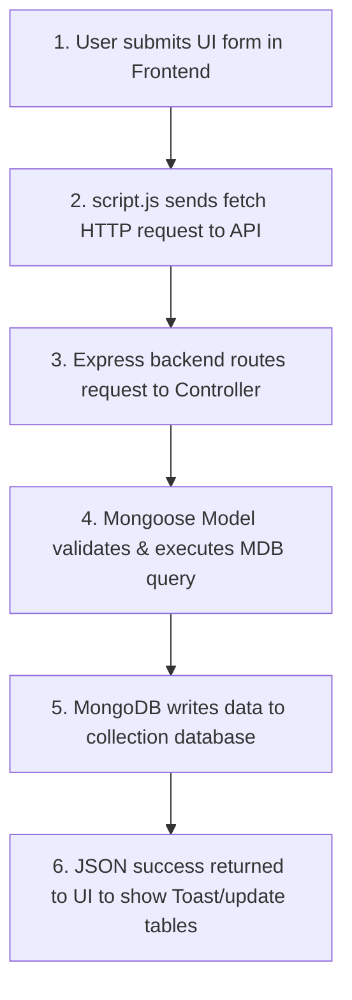
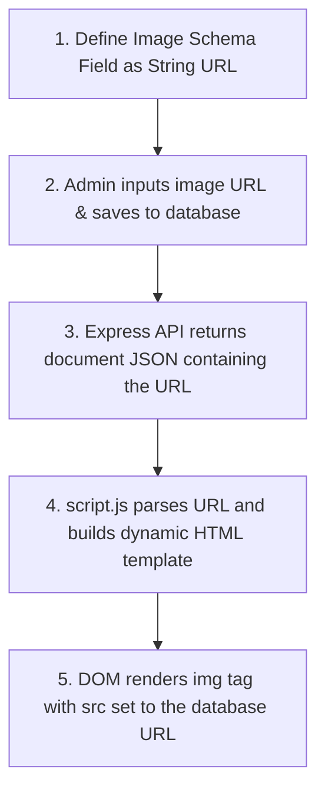

# AI-Solutions Web Portal — User & Administrator Guide

Welcome to the **AI-Solutions Web Portal**. This is a completely dynamic, responsive Single Page Application (SPA) with a Node.js/Express backend and MongoDB. It features a ChatGPT-style AI assistant widget, light/dark mode theme support, testimonial carousel, and a full-featured admin content dashboard.

---

## 🚀 Getting Started (How to Run the System)

### Prerequisites
- [Node.js](https://nodejs.org/) (v16+)
- [MongoDB](https://www.mongodb.com/) (Local installation or MongoDB Atlas cluster connection)

### 1. Installation
Clone or navigate to the workspace, then install the dependencies for both frontend and backend:

```bash
# Install backend dependencies
cd backend
npm install
```

### 2. Environment Configuration
Create a `.env` file in the `backend/` directory with the following variables:

```env
PORT=5000
MONGODB_URI=your_mongodb_connection_uri
JWT_SECRET=your_jwt_signature_secret_key
NODE_ENV=development
```

*(Note: A pre-configured remote database cluster URI is supplied in the workspace `.env` by default).*

### 3. Database Seeding
To populate the database with default services, team members, blog posts, testimonials, and administrative accounts, run the seed command inside the `backend` folder:

```bash
npm run seed
```

This clears existing entries and creates:
- **Admin Account**: `admin@ai-solutions.co.uk` (Password: `AdminPass123!`)
- **Standard User**: `user@ai-solutions.co.uk` (Password: `UserPass123!`)
- Initial portfolio of 6 Services, 3 Events, 3 Blogs, 6 Gallery items, 10 Partners, and 2 Testimonials.

### 4. Running the Development Server
Run the dev task inside the `backend` folder:

```bash
npm run dev
```
The application will launch on **http://localhost:5000**.

---

## 💾 MongoDB Connection Troubleshooting & Data Storage Guide

### Why the Remote MongoDB Connection Might Fail
The backend is originally configured to connect to a remote MongoDB Atlas database cluster. This connection can fail with errors like `querySrv ECONNREFUSED` or `querySrv ETIMEOUT` due to:
1. **IP Whitelisting**: MongoDB Atlas blocks incoming connections by default unless the client's current IP address is explicitly added to the Atlas Security Whitelist.
2. **Firewalls/VPNs**: Corporate firewalls or local network policies may block outgoing TCP traffic on port `27017` (the standard MongoDB port).
3. **Cluster State**: The remote sandbox cluster may be paused, suspended, or shut down.

**The Solution**: To bypass remote connection issues and eliminate startup delays, set the `MONGODB_URI` environment variable inside [backend/.env](file:///c:/Users/Ripple/OneDrive/Desktop/AI%20Solutions%20Web%20Portal/backend/.env) to point to your local MongoDB instance:
```env
MONGODB_URI=mongodb://127.0.0.1:27017/ai_solutions
```
*Note: The backend is built with an automatic fallback mechanism. If the Atlas connection fails, it will attempt to connect to your local database fallback at `127.0.0.1:27017` automatically.*

---

### How Data is Stored in the Database (Step-by-Step Pipeline)
When you submit a form (like register, send contact inquiry, or create a service offer) in the portal, the data travels through the following sequence:



#### Step 1: Frontend User Action
A user interacts with the UI, such as filling out the inquiry form on the **Contact** page, signing up for an account, or submitting a new service offer in the **Admin Panel**.

#### Step 2: Asynchronous HTTP Fetch
Vanilla JS event listeners in [script.js](file:///c:/Users/Ripple/OneDrive/Desktop/AI%20Solutions%20Web%20Portal/frontend/js/script.js) extract the values from the form inputs, structure them into a JSON payload, and dispatch an asynchronous `fetch()` API request to the backend. For example:
```javascript
const res = await fetch('/api/services', {
  method: 'POST',
  headers: { 'Content-Type': 'application/json', 'Authorization': `Bearer ${token}` },
  body: JSON.stringify({ title, description, price, deliveryTime })
});
```

#### Step 3: Express Routing & Request Handling
The Node.js/Express server (configured in [app.js](file:///c:/Users/Ripple/OneDrive/Desktop/AI%20Solutions%20Web%20Portal/backend/app.js)) receives the request, parses the JSON body, and routes it to the specific controller handler. For service creation, it hits `src/routes/serviceRoutes.js` which executes `createService` inside `src/controllers/serviceController.js`.

#### Step 4: Mongoose Model Validation
The controller maps the parsed request body to a Mongoose model schema (e.g., [Service.js](file:///c:/Users/Ripple/OneDrive/Desktop/AI%20Solutions%20Web%20Portal/backend/src/models/Service.js)). Mongoose validates the types, checks for required fields (e.g. title cannot be empty), and converts the document schema into a database command.

#### Step 5: Document Write to Database
Mongoose sends the database command to MongoDB via the established driver connection. MongoDB writes the document into the corresponding database collection (e.g., `services` or `users`) as a BSON record.

#### Step 6: Response & UI Update
Once written, MongoDB returns the saved document with a generated unique ID (`_id`). The controller intercepts this, sending a `201 Created` status with `{ success: true, data: savedDoc }` back to the frontend. The frontend reads this response, shows a success toast, and dynamically updates the page view (like adding the new row to the table) without requiring a full page refresh.

---

### How to View & Manage Stored Data
You can inspect the stored database tables and records visually:
1. Download and open [MongoDB Compass](https://www.mongodb.com/products/tools/compass) (the official GUI).
2. Connect to the local URL: `mongodb://127.0.0.1:27017`
3. Click on the `ai_solutions` database.
4. You will see collections like `services`, `users`, `blogs`, `events`, and `inquiries`. Click on any collection to view, edit, or delete individual data rows.

---

### Step-by-Step Developer Guides

#### 1. How a New User is Validated and Stored
* **Frontend Checks**: Before submission, the HTML forms perform simple type and length checks (e.g. valid email structure and password length requirements).
* **Mongoose Schema Constraints**: When registration data hits the backend, the user model [User.js](file:///c:/Users/Ripple/OneDrive/Desktop/AI%20Solutions%20Web%20Portal/backend/src/models/User.js) validates constraints:
  - `name`: Must be present (`required: true`) and is trimmed of whitespace.
  - `email`: Checked against a strict email regex (`/^\w+([\.-]?\w+)*@\w+([\.-]?\w+)*(\.\w{2,3})+$/`), converted to lowercase, and marked `unique` to prevent duplicate accounts.
  - `password`: Enforces a minimum length of 6 characters (`minlength: 6`).
* **Duplicate Validation**: The authentication controller checks if the email is already registered using `await User.findOne({ email })` and terminates the request with a `400 Bad Request` if a duplicate is found.
* **Password Hashing (Pre-Save Hook)**: A schema hook (`UserSchema.pre('save', ...)`) automatically intercepts the write:
  - Generates a cryptographically strong salt (`await bcrypt.genSalt(10)`).
  - Hashes the plain-text password (`await bcrypt.hash(this.password, salt)`).
  - Overwrites the plain text with the secure hash. The hashed password is then safely written to the MongoDB `users` collection.

#### 2. How Website Content is Stored in the Database
The website content is 100% dynamic and is pulled from database collections instead of static HTML files:
* **Global Configurations & Hero Copy**: Stored in the `SiteSettings` collection (represented by the [SiteSettings.js](file:///c:/Users/Ripple/OneDrive/Desktop/AI%20Solutions%20Web%20Portal/backend/src/models/SiteSettings.js) model). This includes:
  - HQ Address, Phone, and Email support lines.
  - Company Mission copy.
  - Google Client ID credentials.
  - Hero pre-headings, titles, descriptions, and side-illustration URLs.
* **Service Offerings**: Stored in the `services` collection ([Service.js](file:///c:/Users/Ripple/OneDrive/Desktop/AI%20Solutions%20Web%20Portal/backend/src/models/Service.js) model), representing names, descriptions, prices, and turnaround times.
* **Company Insights (Blogs)**: Stored in the `blogs` collection ([Blog.js](file:///c:/Users/Ripple/OneDrive/Desktop/AI%20Solutions%20Web%20Portal/backend/src/models/Blog.js) model) holding text articles, categories, and cover image links.
* **Events & Workshops**: Stored in the `events` collection ([Event.js](file:///c:/Users/Ripple/OneDrive/Desktop/AI%20Solutions%20Web%20Portal/backend/src/models/Event.js) model) storing dates, times, locations, and list of registered user IDs.
* **Admin Management**: Changing settings or adding logs via the **Admin Panel** sends updates via Express REST routes which write directly to these collections, refreshing public views immediately.

#### 3. How Images are Stored in the Database & Rendered on the Website
The web portal utilizes a CDN-first / URL-referencing architecture to display rich visual media (such as blog posts, team photos, gallery uploads, and event banners). Here is the complete step-by-step pipeline from the database schema to the client browser:



##### Step 1: Database Schema Definition
Images are stored in MongoDB as string references rather than raw binary data (to ensure optimal database performance). Each Mongoose schema defines a field for the image URL.
* For **Services**, **Blogs**, **Events**, and **Team Members**, it is defined as `image`:
  ```javascript
  // See src/models/Blog.js
  image: {
    type: String,
    required: [true, 'Please add an image URL']
  }
  ```
* For **Gallery Items**, it is defined as `imageUrl`:
  ```javascript
  // See src/models/Gallery.js
  imageUrl: {
    type: String,
    required: [true, 'Please add a gallery image URL']
  }
  ```

##### Step 2: Database Storage (Form Submission)
When an administrator adds or updates content in the **Admin Panel**:
1. They paste a public image URL (hosted on CDN/storage like Unsplash, Cloudinary, AWS S3, etc.) into the form's image input field.
2. Submitting the form sends a `POST` or `PUT` request to the backend with the URL as a string in the JSON request body.
3. MongoDB writes the record, saving the URL string (e.g., `"https://images.unsplash.com/..."`) directly in the collection document.

##### Step 3: API Response Retrieval
When the public website loads:
1. The frontend initiates a `GET` request (e.g., `GET /api/blogs` or `GET /api/services`).
2. The Express backend queries MongoDB and responds with a JSON array of documents:
   ```json
   {
     "success": true,
     "data": [
       {
         "_id": "64a...",
         "title": "Adopting AI in Web Development",
         "image": "https://images.unsplash.com/photo-1526374965328-7f61d4dc18c5?w=600",
         "category": "Web Development"
       }
     ]
   }
   ```

##### Step 4: Frontend Template Construction
In [script.js](file:///c:/Users/Ripple/OneDrive/Desktop/AI Solutions Web Portal/frontend/js/script.js), the frontend fetches the data, iterates through the array, and dynamically builds HTML structures using ES6 template literals. The image URL is directly injected into the `src` attribute of an `` tag:
```javascript
// Example rendering for blogs (see line 842 in script.js)
const blogCardsHtml = data.map(b => `
  <div class="blog-card group">
    <div class="relative overflow-hidden rounded-t-xl h-48">
      
    </div>
    ...
  </div>
`).join('');
```

##### Step 5: DOM Rendering & Browser Request
The generated HTML is injected into the DOM (e.g. `document.getElementById('blog-grid').innerHTML = blogCardsHtml`). The browser parses the `` tag, reads the `src` URL string retrieved from your database, and makes a standard HTTP request to retrieve and render the image on the page.

---

##### Alternate Route: Integrating Local File Uploads (Multer Pattern)
If you want to allow users/admins to upload local files directly from their device instead of copy-pasting URLs:
1. **Add File Upload Middleware**: Install `multer` on the backend to parse `multipart/form-data` uploads:
   ```javascript
   const multer = require('multer');
   const upload = multer({ dest: 'public/uploads/' });
   ```
2. **Create Upload API Endpoint**: Configure an endpoint to save the file and return its static path:
   ```javascript
   app.post('/api/upload', upload.single('file'), (req, res) => {
     res.json({ url: `/uploads/${req.file.filename}` });
   });
   ```
3. **Expose Uploads Folder**: Serve the folder as a static resource in Express:
   ```javascript
   app.use('/uploads', express.static(path.join(__dirname, 'public/uploads')));
   ```
4. **Wire up Frontend**:
   * Replace the text input with a `<input type="file">`.
   * Submit the file using `FormData` via `fetch('/api/upload')`.
   * Save the returned path (e.g., `/uploads/example.png`) into the database schema field. The rendering mechanism (``) remains exactly the same!

---

#### 4. How Google Sign-In Functions
* **Google SDK Inclusion**: The site includes Google's script `<script src="https://accounts.google.com/gsi/client" async defer></script>`.
* **OAuth Implicit Flow (Frontend)**: 
  - Clicking the *Continue with Google* button triggers Google Identity Services' Token Client using the configured Google Client ID.
  - The browser prompts a secure Google login window. Once signed in, Google returns a secure `accessToken`.
* **Token Verification (Backend)**:
  - The frontend sends the `accessToken` to `POST /api/auth/google`.
  - The backend receives this token and verifies its authenticity with Google's API natively over HTTPS:
    `https://www.googleapis.com/oauth2/v3/userinfo?access_token=${accessToken}`
  - Upon successful verification, Google returns user profile details (email, name).
* **Automatic Registration/Login**:
  - The backend searches the database for a matching email.
  - If the profile exists, it is authenticated.
  - If the profile does not exist, a new user is created automatically with a secure, random password, and a welcome notification is logged.
  - A JWT token is generated and returned to login the user.

---

## 👤 Normal User Guide

### 1. Account Registration
1. Click **Sign In** in the top navigation bar.
2. Under the auth form card, select the **Sign Up** tab.
3. Fill in your **Name**, **Email Address**, and a **Secure Password**, and submit.
4. You will be logged in automatically and redirected to the Home page.

### 2. Signing In & Using Dashboard
1. Click **Sign In**, fill in your registered email and password.
2. Once authenticated, the header button switches to **Dashboard**. Click it to view:
   - **Profile Settings**: View account information and system inbox notifications.
   - **My Inquiries**: Track custom quotes, feedback, and AI-generated prototype blueprints you've saved.
   - **Registered Events**: View upcoming workshops in Sunderland you've signed up for.
   - **Change Password**: Safely update your security credentials.

### 3. Creating Prototyping Blueprints (AI Chatbot)
1. Open the floating **AI Assistant** bubble in the bottom right.
2. Ask questions naturally in plain English (e.g., *"How much to build an e-commerce shop app?"* or *"Give me a blueprint for a saas dashboard"*).
3. The chatbot will reply in conversational, ChatGPT-like language and generate an interactive **Prototype Blueprint** card.
4. Click **Save Prototype to Inquiries** on the card to log it in your dashboard profile.

---

## 🔑 Administrator Guide

### 1. Administrative Login
1. Click **Sign In** in the navigation header.
2. Use the seeded credentials:
   - **Email**: `admin@ai-solutions.co.uk`
   - **Password**: `AdminPass123!`
3. Once authenticated, the navigation button changes to **Admin Panel**. Click it to access system tools.

> [!NOTE]
> Since standard register requests (`/api/auth/register`) default to the `user` security level, new administrative accounts must be created either by updating the Mongoose `role` field to `'admin'` directly in your database collection or by editing the seed script.

### 2. Updating Website Content
Under the **Admin Panel**, administrators can manage every page dynamically without editing code:

- **Site Settings**: Customize the company name, support phone line, email inbox, office address, mission statement, homepage hero copy, hero side image, and section details.
- **Manage Services**: View, edit, add, or delete digital offerings. You can change titles, pricing, delivery speed, and detailed descriptions.
- **Manage Blogs**: Create new tech insights and articles with custom image links and categories.
- **Manage Events**: Publish new Sunderland workshops, edit dates/locations, or delete events.
- **Manage Gallery**: Keep the workspace design showcase updated by adding fresh project mockups.
- **Manage Team**: Add or remove members of the leadership team.
- **Manage Testimonials**: Create and edit client testimonials (these are instantly rendered on the Home page carousel).
- **Manage Partners**: Update logos for regional tech partners.
- **Manage Inquiries**: Review and reply to client requests. An automatic notification is sent to the client when you reply.

---

## 🎨 Theme & Responsiveness Features

- **Light/Dark Mode**: Click the **Moon / Sun** icon in the header navigation (or mobile menu) to toggle the theme instantly. The site uses CSS variables (`var(--bg-deep)`) to swap styles smoothly without flashing.
- **Responsiveness**: Flex-grids, relative sizing, collapsible navigation drawers, and snap-scrolling testimonials ensure the portal works perfectly on smartphones, tablets, laptops, and ultra-wide screens.
#####

Here is a step-by-step guide on how to upload a new image in any section of the website and save it to the backend database using the newly integrated Cloudinary uploader:

Step 1: Open the Website & Log In as Admin
Open your browser and navigate to the portal login page at http://localhost:5000/#auth.
Log in using the system administrator credentials:
Email: admin@ai-solutions.co.uk
Password: AdminPass123!

Step 2: Open the Admin Panel
Once authenticated, click the Admin Panel link located in the top navigation bar.
Step 3: Choose a Content Section to Modify
In the left sidebar of the Admin Panel, click on the section you want to add or update content for. You can choose from:
Services (e.g., adding service offers)
Blogs (e.g., drafting articles)
Events (e.g., scheduling meetups)
Gallery (e.g., publishing design assets)
Team (e.g., adding staff profiles)
Testimonials (e.g., adding client recommendations)
Site Settings (updating homepage branding hero and about images)
Step 4: Open the CRUD Form Modal
Click the Add button at the top-right of your selected section (such as Add Service, Add Blog, Add Image, Add Member, Add Testimonial) or click Edit on an existing item's row.
Step 5: Upload the Image via Cloudinary
Within the form modal, locate the premium image uploader component:

Click the Upload File tab at the top-right of the widget.
Drag & drop your image file directly into the dotted dropzone box, or click the box to browse and select an image from your local computer.
A loading spinner will appear while the file is uploaded.
Once completed, you will see a thumbnail preview of the image, the generated cloudinary.com URL displayed below it, and a green Ready checkmark indicating the upload succeeded. (Note: You can still use the URL Link tab if you prefer to paste a direct image link like an Unsplash URL).
Step 6: Save the Record to the Database
Complete any remaining fields in the form (e.g. titles, tags, text, price).
Click the form's submit button (e.g. Publish Offer, Save Changes, Add Member, Save Global Settings).
The frontend will dispatch a request to the backend API containing the Cloudinary image URL.
The backend controller saves the URL string into MongoDB under the corresponding schema field (e.g. image or imageUrl). The site sections instantly reflect the updated image.
